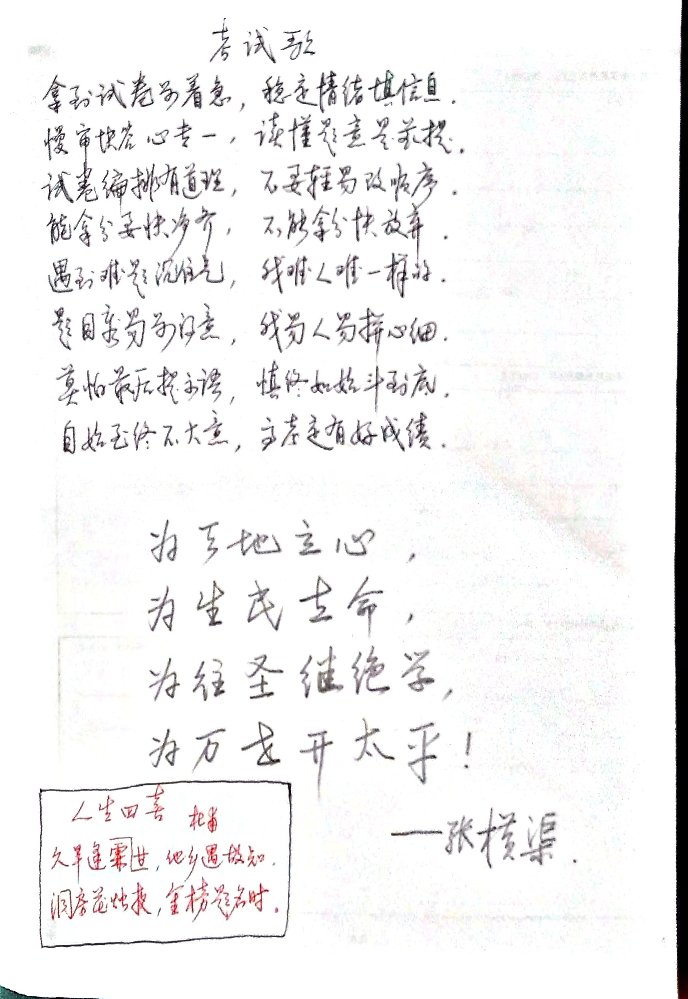

# 考试歌

**拿到试卷别着急    稳定情绪填信息**

**慢审快答心专一    读懂题意是前提**

**试卷编排有道理    不要轻易改顺序**

**能拿分要快净齐    不能拿分快放弃**

**遇到难题沉住气    我难人难一样的(dì)**

**题目容易别得意    我易人易拼心细**

**莫怕最后提示语    慎终如始斗到底**

**自始如终不大意    高考定有好成绩**

<figure><figcaption></figcaption></figure>
